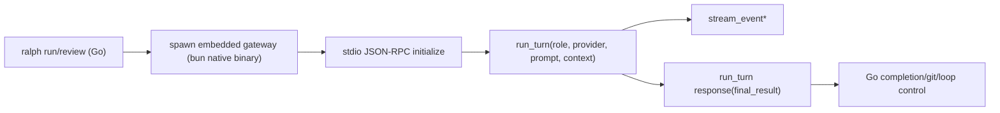

# Go + TS Agent Gateway Integration - Design

## Overview

本ドキュメントは、`ralph` の main 実行経路を `sh -c <agent command>` から、Go runner + TypeScript gateway（bun native compile 済みバイナリ）構成へ移行する設計を定義する。  
Go は既存どおり loop / config validation / completion / git 制御を担い、TS gateway は `codex` / `claude` SDK 呼び出しを担う。

本変更は breaking change とし、既存の `agent.run_command` / `agent.review_command` / `agent.judge_command` は廃止する。  
`run` / `review` / `judge` は role 別 provider 設定で切り替える。

## Goals

- `ralph run` / `ralph review` の両 mode で gateway 経由実行を統一する。
- TS 側 SDK 依存（Codex/Claude）を Go 本体から分離し、追従コストを局所化する。
- ユーザー体験として「手動で gateway を先に起動しない」運用を実現する（Go が自動起動）。
- 配布時に Node 依存を持たないため、bun native compile バイナリを `go:embed` して利用する。
- 既存 completion / review convergence / exit code 体系を維持する。

## Non-Goals

- v1 での Unix socket transport 対応（stdio のみ）。
- v1 での非 `darwin/arm64` ターゲット配布。
- 既存 command 設定との互換レイヤー維持。
- v1 での gateway 常駐デーモン管理コマンド（`start/stop/status`）追加。

## Background

現行 runner の main 実行は `sh -c <agent command>` で外部 CLI を直接起動する。  
この方式はシンプルだが、SDK 連携を進めると Go 側に provider 差分を持ち込みやすくなる。

一方で、フル TypeScript 移行は loop/validation/git の既存 Go 資産を再実装するコストが高い。  
そのため、Go 本体を維持しつつ TS gateway に SDK 呼び出しを委譲するハイブリッド構成を採用する。

## Decomposition Strategy

- Split Decision: `single`
- 理由: 本件は「main 実行経路の gateway 化」という単一境界で、受け入れも `run/review/judge` の統合挙動で評価できるため。
- 文量注記: breaking change に伴う責務境界と sunset 条件の明文化が必要なため、記述量は core profile の目安より長くなる。

## Clarifications

| Question | Answer / Assumption | Finalization Trigger | Impact | Status |
|----------|----------------------|----------------------|--------|--------|
| 対象 mode は `run` だけか？ | `run` / `review` の両方を対象とする。 | N/A | main 実行経路を mode 共通で gateway 化する。 | resolved |
| 既存 command 実行経路は残すか？ | 残さない。gateway を唯一経路とする breaking change。 | N/A | config 互換レイヤーを持たない。 | resolved |
| bun 配布ターゲットは？ | 初期は `darwin/arm64` のみ。 | N/A | 非対応プラットフォームは明示エラーで失敗。 | resolved |
| provider 対象は？ | 初期から `codex` / `claude` 両対応。 | N/A | TS gateway に provider adapter 2 系統を実装する。 | resolved |
| transport は？ | v1 は `stdio + JSON-RPC` のみ。 | N/A | Unix socket は将来拡張とする。 | resolved |
| provider 設定粒度は？ | `run` / `review` / `judge` で provider を個別指定可能。 | N/A | role-aware provider 解決ロジックが必要。 | resolved |
| role 別 provider 未指定時の挙動は？ | `review` / `judge` 未指定時は `run` provider へ fallback。 | N/A | 解決順を仕様化できる。 | resolved |
| gateway contract の SoT は？ | Go/TS の protocol 型定義を SoT とし、v1 では standalone jsonschema artifact は持たない。 | N/A | artifact 管理コストを持たずに、型定義と互換テストで契約整合を維持できる。 | resolved |
| Claude settings/skills の読み込み方針は？ | `setting_sources` の既定値を `project,user,local` とする。 | N/A | provider ごとの設定差分を gateway 設定に吸収する。 | resolved |
| `stream_event` の既定出力先を切り替え可能にするか？ | v1 は CLI 切替オプションを追加せず、`stream_event` は `stderr` 固定とする。 | N/A | 機械可読出力（stdout）と進捗ログ（stderr）の分離を簡素に保証する。 | resolved |
| env による config 上書きを導入するか？ | v1 は導入しない。`.ralph/config.yml` を単一 SoT とする。 | N/A | 設定解決経路を単純化し、既存 `ralph` 仕様と整合する。 | resolved |

## Proposed Solution

- `ralph` は control plane として loop/config/completion/git と gateway lifecycle を保持する。
- `agent-gateway` は execution plane として `codex` / `claude` SDK 呼び出しと stream 正規化を担う。
- `run/review/judge` は role-aware provider で実行し、`run_turn` は全 role で structured output を返す。
- protocol contract は Go/TS 型定義 + 共有 fixture で管理し、互換性は `protocol_version` で分離する。

## Detailed Design

### 1. Runtime Architecture

責務分離:

- Go (`ralph`):
  - config load/validation
  - loop scheduling（run/review/judge）
  - completion 判定
  - git 制御
  - gateway プロセス lifecycle 管理
- TS (`agent-gateway`):
  - provider adapter（codex-sdk / claude-agent-sdk）
  - turn 実行
  - stream event 送出
  - final result 返却

### 1.1 Responsibility Boundary (Owner Matrix)

| Area | Primary Owner | Responsibilities | Out of Scope |
|------|---------------|------------------|--------------|
| control plane | Go (`ralph`) | loop 制御、role/provider 解決、gateway lifecycle、completion/git 制御、exit code 決定 | provider SDK 直呼び出し |
| execution plane | TS (`agent-gateway`) | provider SDK 実行、provider 差分吸収、stream 正規化、`run_turn` 応答生成 | loop/completion/git 制御 |
| contract plane | Protocol (Go/TS type definitions + compatibility fixtures) | request/response/notification 契約固定、互換性境界（`protocol_version`）定義、言語間整合テスト | provider 固有振る舞い定義 |

責務境界ルール:

- Go は SDK 実装差分を持たない。
- TS は completion 判定ロジックを持たない。
- protocol 変更は Go/TS 型定義と互換 fixture を同時更新し、互換破壊なら `v2` へ分離する。



### 2. Gateway Packaging and Startup

- `agent-gateway` は bun native compile で `darwin/arm64` 実行バイナリを生成する。
- 生成物は圧縮アーカイブ + sha256 で Go バイナリに `go:embed` する。
- 実行時に `UserCacheDir` 配下へ展開し、checksum 検証後に実行する。
- Go は gateway 生存確認ではなく、`ralph` プロセス配下で子プロセスとして都度起動する（手動常駐不要）。
- 起動は `exec.CommandContext(context.Background(), <gateway>, "stdio")` を使い、終了時は graceful shutdown 後に kill fallback を持つ。

### 3. Transport and Protocol

v1 transport は stdio JSON-RPC のみ。

リクエスト:

- `initialize`
- `run_turn`
- `cancel_turn`
- `shutdown`
- `run_turn` は role ごとの `output_schema` 指定を必須とする。

通知:

- `stream_event`（token/log/tool status など）

レスポンス:

- `run_turn` の返り値として `final_result` を返す（request/response 型）。
- `final_result.structured_output` は全 role で必須とする。

相関:

- JSON-RPC `id` で request/response を対応付ける。
- `stream_event` は `turn_id` と `seq` を必須にし、同一 turn 内で単調増加。
- `run_turn` ごとに `final_result` はちょうど 1 回。

### 3.1 Unified Stream Event Contract

provider 差分は gateway 内で正規化し、Go 側は単一イベント契約のみ扱う。

v1 event type:

- `init`
- `text`
- `thinking`
- `tool_use`
- `tool_output`
- `tool_result`
- `error`

契約:

- `seq` は turn ごとに単調増加し、欠番は許容、逆行は不正。
- ストリーミング delta と最終 message の重複送出を禁止する（同一内容の二重 emit を gateway で抑止）。
- `stream_event` は進捗専用で `stderr` へ出力し、`stdout` は最終結果系出力を優先する。

### 3.2 Type-driven Contract Validation

- protocol contract の SoT は Go/TS の protocol 型定義とする。
- v1 では standalone な protocol jsonschema artifact を出力しない。
- Go 側は型デコードと必須フィールド検証で message validate を行い、破損 message は protocol violation として扱う。
- TS 側も同等の型/バリデーション実装で message validate を行う。
- 互換性は共有 fixture（valid/invalid message）を Go/TS 双方で実行して担保する。
- compatibility break は `protocol_version` を上げて分離する（`v1` -> `v2`）。

### 4. Role-aware Provider Resolution

config で role 別 provider を指定する。

解決順:

1. `role_provider.<role>`
2. fallback `role_provider.run`

role:

- `run`
- `review`
- `judge`

provider 値:

- `codex`
- `claude`

### 4.1 Provider Support Scope

- v1 で公式サポートする provider は `codex` / `claude` の 2 つのみ。
- provider 差分（stream 形式、SDK オプション差異）は gateway 内で吸収し、Go は共通契約のみ扱う。

### 4.2 Resolution Algorithm and Source Trace

provider 解決は deterministic に固定する。

```text
resolveProvider(role):
  if role_provider[role] is set: use it (source=role)
  else use role_provider.run (source=fallback_run)
```

dry-run には以下を表示する:

- `provider.<role>.resolved`
- `provider.<role>.source` (`role` or `fallback_run`)

### 5. Config Model (Draft)

```yaml
version: "1"

agent:
  gateway:
    transport: stdio
    startup_timeout_seconds: 10
    rpc_timeout_seconds: 1800
    idle_timeout_seconds: 600
  role_provider:
    run: codex
    review: claude
    judge: claude
  providers:
    codex:
      # working_directory is inherited from runner working dir when omitted.
      working_directory: ""
    claude:
      # default: project,user,local
      setting_sources: ["project", "user", "local"]

completion:
  run:
    strategy: tail_match
    signal: "<promise>COMPLETE</promise>"
    tail_lines: 20
  review:
    strategy: review_convergence
    signal: "<promise>COMPLETE</promise>"
    review_convergence:
      min_reviews: 3
      max_reviews: 10
      judge_every: 2
      stable_rounds: 2
```

breaking changes:

- remove: `agent.run_command`
- remove: `agent.review_command`
- remove: `agent.judge_command`

validation:

- `agent.gateway.transport` は `stdio` のみ許容。
- `role_provider.run` は必須。
- `role_provider.review` / `role_provider.judge` は任意（未指定時 fallback）。
- provider は `codex` / `claude` のみ。

### 5.1 Config Scope

- v1 の設定 SoT は `.ralph/config.yml` のみとする。
- env での config 上書きは提供しない。
- 設定の有効値は `ralph run --dry-run` / `ralph review --dry-run` で確認する。

### 6. Main Step Behavior

- `runMainStep` は shell command 実行を廃止し、gateway client 呼び出しへ置換する。
- 入力は従来どおり prompt file（judge は machine context prefix + prompt）を使用。
- gateway からの `stream_event` は runner の標準エラー出力（`stderr`）へ転送する。
- `final_result.structured_output` を正とし、`run/review` では `output_text` を tmpfile に保存して completion 判定ロジックを維持する。
- `review` mode の artifact 生成（`REVIEW_n.md` / `JUDGE_n.json`）は現行と同じ保存規約を維持する。

### 6.1 Structured Output Handling

- `run` / `review` / `judge` の全 role で `run_turn.output_schema` を必須化する。
- gateway は全 role で `final_result.structured_output` を必須で返し、schema 不一致・欠落は protocol violation とする。
- `run` / `review` は `output_text` 必須フィールドを持つ schema を利用し、runner は `structured_output.output_text` を main 出力として扱う。
- `judge` role は `JUDGE_n.json` を出力する既存契約を維持し、runner は `structured_output` を `JUDGE_n.json` として永続化して収斂判定に利用する。
- structured output が得られない場合は fallback parse を行わず、runtime error（exit `22`）とする。

### 7. Failure Handling

- gateway 起動失敗、初期化失敗、RPC timeout、protocol violation は runtime error（exit `22`）。
- `run_turn` 実行中の gateway プロセス異常終了時は 1 回だけ再起動 + 同一 turn 再試行を許可する。
- 再試行後も失敗した場合は runtime error（exit `22`）。
- `cancel_turn` は SIGINT/SIGTERM 終了時の best-effort 経路として実装する。

### 7.1 Retry and Timeout Taxonomy

timeout を分離して扱う。

- `startup_timeout_seconds`: gateway 起動と initialize の上限
- `rpc_timeout_seconds`: 1 turn 全体の上限
- `idle_timeout_seconds`: stream 無通信上限

retry を分類して扱う。

- retryable: transport 切断、一時 network エラー、idle timeout
- non-retryable: validation error、schema violation、capability 不足、permission 拒否

v1 retry 規則:

- 同一 turn で最大 1 回再試行
- exponential backoff（定数定義）を適用
- retry 実行理由を debug ログへ必ず残す

### 8. UX

- ユーザー操作は `ralph run` / `ralph review` のまま変更しない。
- 手動で gateway を起動する必要はない。
- 初回起動は gateway 展開・起動により追加レイテンシが発生するが、loop 実行中は同一プロセスを再利用する。
- `stream_event` は v1 で `stderr` 固定出力とし、`stdout` は最終結果系出力に優先的に使う。

### 9. Build and Release

- build pipeline に gateway compile ステップを追加する。
- bun compile 出力をアーカイブ化し、sha256 を生成する。
- Go build 時に `darwin/arm64` 対象アーカイブを embed する。
- 非対応プラットフォームでは明示的に `errNoBundledGatewayForPlatform` を返し、回避方法を案内する。

### 10. Test Strategy

- config validation:
  - legacy command keys を拒否するテスト
  - role_provider fallback テスト
  - provider enum/transport enum テスト
  - config-only 解決（env 上書きなし）テスト
- runner:
  - gateway mock/stub による run/review/judge の role 別実行テスト
  - stream_event と final_result 受信順/相関テスト
  - unified stream contract（重複抑止）テスト
  - 再起動リトライ（1回）テスト
  - 全 role structured output 必須（欠落/型不一致で失敗）テスト
  - `run/review` の `structured_output.output_text` 永続化テスト
  - `judge` の `structured_output` から `JUDGE_n.json` 永続化テスト
- packaging:
  - checksum 検証失敗テスト
  - materialize/cleanup テスト
  - unsupported platform テスト
- protocol:
  - 共有 fixture（valid/invalid message）を使った Go/TS 契約互換テスト
  - `run_turn`, `stream_event`, `final_result` の encode/decode 契約テスト
  - `run_turn.output_schema` 必須・`final_result.structured_output` 必須の検証テスト
  - unknown event / invalid seq の拒否テスト

### 11. Protocol Contract

- gateway contract の SoT は Go/TS の protocol 型定義とする。
- JSON-RPC message の request/response/notification payload は同型定義と共有 fixture で定義・検証する。
- versioning は `protocol_version`（例: `v1`）で handshake し、互換性のない変更は `v2` として分離する。

## Acceptance Criteria

1. `run/review` の main 実行は gateway 経路のみを利用し、`agent.run_command` / `agent.review_command` / `agent.judge_command` は廃止される。
2. provider 解決は role 別指定を優先し、`review` / `judge` 未指定時は `run` provider へ fallback する。
3. `run_turn.output_schema` は全 role で必須、`final_result.structured_output` も全 role で必須となる。
4. `run/review` は `structured_output.output_text` を completion 判定入力として利用し、`judge` は `JUDGE_n.json` を永続化する。
5. transport は v1 で `stdio + JSON-RPC` のみとし、`stream_event` は `stderr` へ出力される。
6. ユーザーは手動で gateway を起動せずに `ralph run` / `ralph review` を実行できる。
7. protocol 契約は Go/TS 型定義と共有 fixture で検証され、破損 message は protocol violation として扱われる。
8. `darwin/arm64` 以外では `errNoBundledGatewayForPlatform` により明示的に失敗する。

## Compatibility & Sunset

この変更は breaking change であり、旧 config の後方互換は提供しない。
TEMP の lifecycle SoT は ADR `0006` の `Sunset Clause` とする。
参照: [0006](../adr/0006-embed-bun-agent-gateway-for-main-execution.md)

### Temporary Mechanism Index

| ID | Mechanism | Lifecycle Record | Status |
|----|-----------|------------------|--------|
| TEMP01 | `darwin/arm64` 限定の bundled gateway 配布 | ADR `0006` `Sunset Clause` | Active |
| TEMP02 | gateway 異常終了時の「1回のみ」固定再試行 | ADR `0006` `Sunset Clause` | Active |

### Sunset Closure Checklist

| ID | Introduced For | Retirement Trigger | Retirement Verification | Removal Scope | Owner | Target |
|----|----------------|--------------------|-------------------------|---------------|-------|--------|
| TEMP01 | 早期に gateway 統合を出荷するため | `linux/amd64`, `linux/arm64`, `windows/amd64` の gateway 配布と CI 成功 | 対象 OS/arch で `ralph run --dry-run` と e2e が green | `darwin/arm64` 限定分岐と単一 bundle 前提の packaging/起動ロジックを削除し、multi-platform bundle 解決へ置換する（See ADR `0006` `Sunset Clause`） | @ralph-maintainers | 2026-Q2 |
| TEMP02 | 初期運用で過剰再試行を避けつつ可用性を確保 | エラー分類（retryable/non-retryable）を protocol に導入 | retry policy table の導入と分類別テスト追加 | 「固定1回のみ再試行」の実装分岐を削除し、分類駆動 retry policy に置換する（See ADR `0006` `Sunset Clause`） | @ralph-maintainers | 2026-Q2 |

## Decision Log

| ADR | Decision | Status |
|-----|----------|--------|
| [0006](../adr/0006-embed-bun-agent-gateway-for-main-execution.md) | Go runner + bun-compiled TS gateway の stdio JSON-RPC 構成を採用し、main 実行を gateway 専用化する | Proposed |
